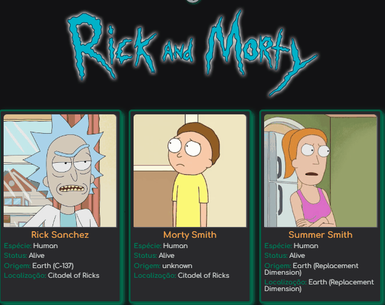

# PROJETO RICK AND MORTY 💻

Projeto desenvolvido para aprimorar habilidades no consumo de API's 👌.
Minha  principal motivação no desenvolvimento da aplicação foi colocar em prática meus conhecimento na área web front-end e por eu ser fã dessa série incrível❤️❤️🚀.

### Imagem do Projeto 👌

### Links

- Deploy: [https://vitorlopes523.github.io/projeto-rick-morty/]
- Repositório: [https://github.com/vitorlopes523/projeto-rick-morty]
- API do Rick and Morty: [https://rickandmortyapi.com/api/character]

## Meu processo

### Construído com

- HTML5 (Hypertext Markup Language)
- CSS (Cascading Style Sheets)
- API (Application Programming Interface)
- JavaScript (Programming Language)

### Desenvolvimento contínuo

- Aprimorar conhecimentos em HTML e sua semântica.
- Aprimorar acerca das propriedades CSS, principalmente flexbox e grid.
- Aprimorar conhecimentos em JavaScript.
- Aprender e aperfeiçoar o framework React.
- Desenvolver técnicas que melhore meu status como profissional.

Espero que tenha gostado!🙂